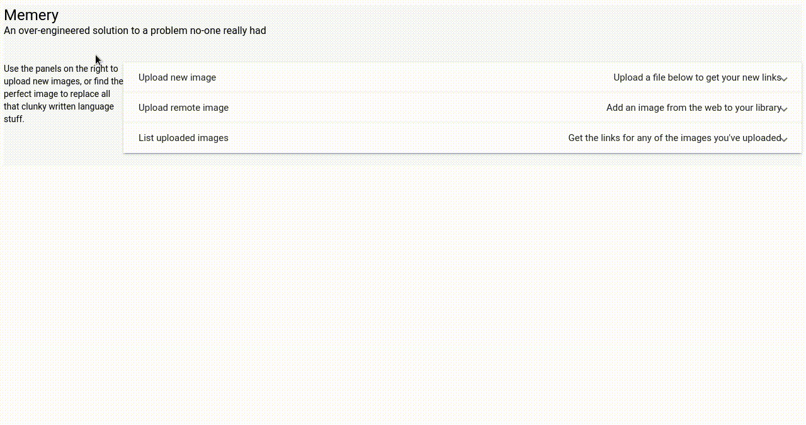

# Memery

## A stupid and simple little app for those of us on yesteryear's chat platforms

So in short my team don't use Slack. We don't get all that pretty GIF ~~shit~~ content. Unfortunately, we're also security people so we don't communicate in English. We communicate in *War Games* quotes and the most expressive medium on the planet: **memes**.

This is a simple container-based application for making links to uploaded memes and sharing them: predictably or in surprise mode.

Upload your favourite meme, optionally give it a name, and you'll get two links to your new web-powered meme goodness: one has the name right there in the link so people know what they're getting, the other is a code that redirects to your image, making your meme a fun (or horrifying) surprise for your teammates.



### Usage

Ha! You thought there'd be docs.

### Installation

Installing? It's 2018, it's time for some goddamned containers people

#### Docker

Just run `docker run -p 5000:5000 agc93/memery` and Memery will be ready to go on port 5000.

You can build the image yourself invoking the build script with the `Docker` target. You'll (obviously) need Docker installed and available to your user.

```bash
./build.sh --target=Docker
```

#### Command Line

Obviously, we've got a command line. Efficiency is key when it comes to quality memes. Run `./build.sh --target="Build-Console-Package"` and use the package for your platform from `dist/packages/`. Run `memery` to get the help.

#### OpenShift

This image *should* work out-of-the-box on OpenShift, but it also won't save your memes if you just use the normal Docker image. For best results, use the template at `template/openshift.yaml`.

There's also an extra template at `template/cli-openshift.yaml` that creates a Downlink-powered download server for the CLI.

### Notes

- In a hilarious display of irony, this is not secure at all and don't go showing it off to the internet
- Also don't go trying to break it with clever file uploads. It will work (i.e. it will break, you muppet).
- Seriously, there's basically no docs. If you have questions/suggestions/problems, put them in the Issues. If you have complaints, keep them to yourself.